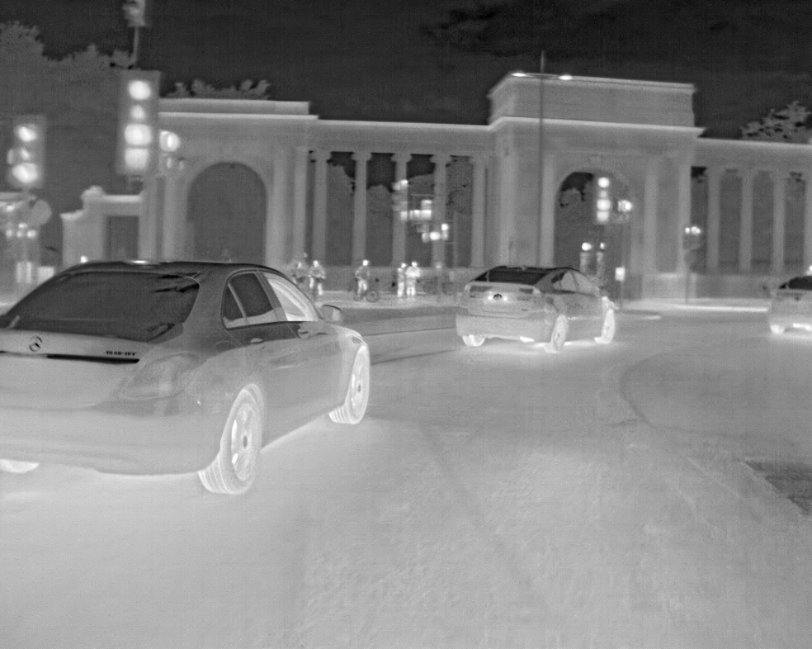

<!--

-->
The FLIR ADAS set contains...

Import the required packages:
```python
import pathlib
import torch
import torchvision
import torch.utils.data
from torchvision import models, datasets, transforms
from torchvision.datasets import CocoDetection
from torchvision.models.detection import FasterRCNN_ResNet50_FPN_Weights
```
Load the data and ensure that cuda is using my GPU rather than the CPU
```python
IMAGES_PATH = pathlib.Path(r"C:\Users\Brenon\Desktop\FLIR_Thermal_Dataset\FLIR_ADAS_v2\images_thermal_train")
ANNOTATIONS_PATH = IMAGES_PATH / "coco_train.json"

device = torch.device("cuda" if torch.cuda.is_available() else "cpu")
```
