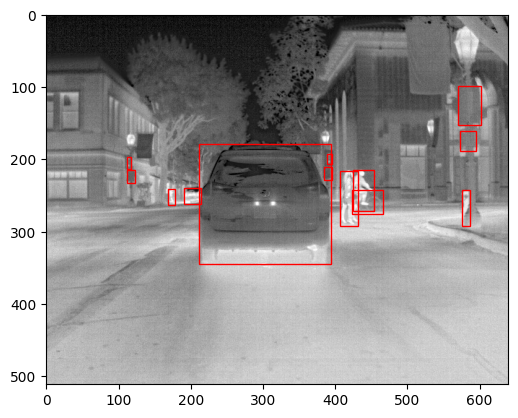

The FLIR ADAS dataset is structured into three main categories: training images ("train"), validation images ("val"), and validation videos ("val_video"). The images and video frames were sampled from independent video sequences to enhance model generalization. The dataset includes 9,711 thermal and 9,233 RGB training/validation images, split 90%/10% between train and val sets, along with 7,498 validation video frames. Each of the 3,749 thermal/RGB video pairs contains continuous frames captured at 30 frames per second (FPS), with time-synced frames mapped between the thermal and RGB spectrums in the rgb_to_thermal_vid_map.json file. Data was collected in diverse locations under various lighting and weather conditions. More detailed information can be found in the "extra_info" section of the coco.json annotations.

The dataset was captured using a thermal and visible camera pair mounted on a vehicle, with thermal images captured by a Teledyne FLIR Tau 2 camera and visible images by a Teledyne FLIR BlackFly S camera. Time-synced capture was managed by Teledyne FLIR's Guardian software. Validation videos, collected at 30 FPS, include target IDs for tracking metrics like MOTA/MOTP. Frames were selected for diversity, excluding redundant footage. Annotations are provided in Conservator JSON format for Teledyne FLIR's proprietary tool and COCO format for training, with COCO-formatted files recommended for training models. The dataset uses a modified MSCOCO label map inspired by the Berkeley Deep Drive dataset, covering categories like person, bike, car, motor, bus, train, truck, light, hydrant, sign, dog, skateboard, stroller, scooter, and other vehicles. Detailed annotation counts for thermal and visible images are also provided.

This dataset can be downloaded for free using the following link: https://www.flir.com/oem/adas/adas-dataset-form/

Import the required packages:
```python
import pathlib
import torch
import torchvision
import torch.utils.data
from torchvision import models, datasets, transforms
from torchvision.datasets import CocoDetection
from torchvision.models.detection import FasterRCNN_ResNet50_FPN_Weights
```
Load the data and ensure that cuda is using my GPU rather than the CPU
```python
IMAGES_PATH = pathlib.Path(r"C:\Users\Brenon\Desktop\FLIR_Thermal_Dataset\FLIR_ADAS_v2\images_thermal_train")
ANNOTATIONS_PATH = IMAGES_PATH / "coco_train.json"

device = torch.device("cuda" if torch.cuda.is_available() else "cpu")
```

```python
class MyTransform:
    def __init__(self):
        self.transforms = transforms.Compose([
            transforms.ColorJitter(brightness=0.1, contrast=0.1, saturation=0.1, hue=0.1),
            transforms.ToTensor(),
        ])

    def __call__(self, img, target):
        img = self.transforms(img)
        return img, target

dataset = CocoDetection(str(IMAGES_PATH), str(ANNOTATIONS_PATH), transforms=MyTransform())
dataset = datasets.wrap_dataset_for_transforms_v2(dataset, target_keys=["boxes", "labels"])

data_loader = torch.utils.data.DataLoader(
    dataset,
    batch_size=16,
    collate_fn=lambda batch: tuple(zip(*batch)),
)
```
Display three random images from the data, one of the three is shown below
```python
def display_image_with_boxes(image, boxes):
    fig, ax = plt.subplots(1)
    ax.imshow(image.permute(1, 2, 0))
    for box in boxes:
        xmin, ymin, xmax, ymax = box
        width = xmax - xmin
        height = ymax - ymin
        rect = patches.Rectangle((xmin, ymin), width, height, linewidth=1, edgecolor='r', facecolor='none')
        ax.add_patch(rect)
    plt.show()

for _ in range(3):
    index = random.randint(0, len(dataset) - 1)
    image, target = dataset[index]
    display_image_with_boxes(image, target['boxes'])
```


This code loads a Faster R-CNN model with ResNet 50 weights, creates an optimizer and scheduler, then does some error handling for batches that contain images with no bounding boxes. There is for sure a more elegant way of doing this, but this was a quick and temporary work around. 
```python
# Using Resnet weights
weights = models.detection.FasterRCNN_ResNet50_FPN_Weights.DEFAULT

# Initialize the model with the specified pretrained weights and move to GPU
model = models.detection.fasterrcnn_resnet50_fpn(weights=weights).to(device)
model.train()

# Initialize the optimizer
optimizer = torch.optim.SGD(model.parameters(), lr=0.005, momentum=0.9, weight_decay=0.0005)
scheduler = StepLR(optimizer, step_size=3, gamma=0.1)

# Training loop with error handling and detailed logging
for batch_idx, (imgs, targets) in enumerate(data_loader):
    try:
        print(f"Processing batch {batch_idx + 1}/{len(data_loader)}")

        # Move data to the GPU
        imgs = [img.to(device) for img in imgs]
        targets = [{k: v.to(device) for k, v in t.items()} for t in targets]

        # Zero the parameter gradients
        optimizer.zero_grad()

        # Forward pass to calculate losses
        loss_dict = model(imgs, targets)
        losses = sum(loss for loss in loss_dict.values())

        # Backward pass and optimize
        losses.backward()
        optimizer.step()
        scheduler.step()  # Update the learning rate

        # Log image shapes and target types
        print(f"Image shapes: {[img.shape for img in imgs]}, Target types: {[type(target) for target in targets]}")

        # Log losses for each loss type in the model
        for name, loss_val in loss_dict.items():
            print(f"{name:<20}: {loss_val:.3f}")

    except Exception as e:
        # Log the error message and batch index
        print(f"Error processing batch {batch_idx + 1}: {str(e)}")
        continue  # Skip to the next batch
```
Save the model to use for inference later
```python
# Define a path for saving the entire model
COMPLETE_MODEL_SAVE_PATH = pathlib.Path(r"C:\Users\Brenon\Desktop\complete_model.pth")

# Save the entire model, optimizer, and any additional information
torch.save({
    'model': model,
    'model_state_dict': model.state_dict(),
    'optimizer_state_dict': optimizer.state_dict(),
    'scheduler_state_dict': scheduler.state_dict()
}, COMPLETE_MODEL_SAVE_PATH)

print(f"Complete model, optimizer, and scheduler saved at {COMPLETE_MODEL_SAVE_PATH}")

####
#below is to save state dictionary and optimizer settings


# Define a path for saving the model's state dictionary
MODEL_STATE_DICT_PATH = pathlib.Path(r"C:\Users\Brenon\Desktop\model_state_dict.pth")

# Save the model's state dictionary and optimizer's state dictionary
torch.save({
    'model_state_dict': model.state_dict(),
    'optimizer_state_dict': optimizer.state_dict(),
}, MODEL_STATE_DICT_PATH)

print(f"Model state dictionary and optimizer state saved at {MODEL_STATE_DICT_PATH}")
```
This project spanned multiple days so it was necessary to load the saved model
```python
MODEL_SAVE_PATH = pathlib.Path(r"C:\Users\Brenon\Desktop\complete_model.pth")

# Set up the device to use GPU if available, otherwise use CPU
device = torch.device("cuda" if torch.cuda.is_available() else "cpu")

# Load the entire model and components
checkpoint = torch.load(MODEL_SAVE_PATH, map_location=device)

# Restore the model
model = checkpoint['model']
model.load_state_dict(checkpoint['model_state_dict'])
model = model.to(device)

optimizer = torch.optim.SGD(model.parameters(), lr=0.005, momentum=0.9, weight_decay=0.0005)
scheduler = StepLR(optimizer, step_size=3, gamma=0.1)

# Load the optimizer and scheduler states
optimizer.load_state_dict(checkpoint['optimizer_state_dict'])
scheduler.load_state_dict(checkpoint['scheduler_state_dict'])

# Ensure the model is in the correct mode, e.g., training or evaluation
# model.train()  # Use if continuing training
model.eval()   # Use if performing evaluation

print("Model, optimizer, and scheduler have been successfully loaded and are ready to use.")
```
I decided to use Fiftyone for inference and visualization
```python
import fiftyone.utils.coco as fouc
import fiftyone as fo

# Path to the directory where the images are stored
dataset_dir = r"C:\Users\Brenon\Desktop\FLIR_Thermal_Dataset\FLIR_ADAS_v2\video_thermal_test"

# Path to the COCO formatted JSON file
annotations_path = r"C:\Users\Brenon\Desktop\FLIR_Thermal_Dataset\FLIR_ADAS_v2\video_thermal_test\coco_test.json"

# Load the dataset
dataset = fo.Dataset.from_dir(
    dataset_type=fo.types.COCODetectionDataset,
    data_path=dataset_dir,
    labels_path=annotations_path,
    name="flir_dataset_test"
)
```
This will run inference on 100 images and bring up the Fiftyone interface for inspection
```python
from PIL import Image
import torch
from torchvision.transforms import functional as F

# Set up the device to use GPU if available
device = torch.device("cuda" if torch.cuda.is_available() else "cpu")

# Assuming the dataset has been loaded as 'dataset'
# Take a random subset of 100 samples for predictions
predictions_view = dataset.take(100, seed=51)

# Get class list (assuming your dataset has default classes defined)
classes = dataset.default_classes

print("Number of classes:", len(classes))

# Add predictions to samples
with fo.ProgressBar() as pb:
    for sample in pb(predictions_view):
        # Load image
        image = Image.open(sample.filepath)
        image_tensor = F.to_tensor(image).to(device)
        c, h, w = image_tensor.shape  # c, h, and w are the channel, height, and width

        # Perform inference
        preds = model([image_tensor])[0]
        labels = preds['labels'].cpu().detach().numpy()
        scores = preds['scores'].cpu().detach().numpy()
        boxes = preds['boxes'].cpu().detach().numpy()

        print("Predicted labels:", labels)  # Check what labels are being predicted

        # Convert detections to FiftyOne format
        detections = []
        for label, score, box in zip(labels, scores, boxes):
            if label < len(classes):  # Check if label is within the valid range
                x1, y1, x2, y2 = box
                rel_box = [x1 / w, y1 / h, (x2 - x1) / w, (y2 - y1) / h]

                detections.append(
                    fo.Detection(
                        label=classes[label],
                        bounding_box=rel_box,
                        confidence=score,
                        color="red"
                    )
                )
            else:
                print("Label index out of range:", label)  # Print out-of-range label

        # Save predictions to dataset
        sample["predictions"] = fo.Detections(detections=detections)
        sample.save()

# Update the session to view the predictions
session = fo.launch_app(view=predictions_view)
```
The image below shows a screen shot of the Fiftyone interface. The detections and segmentations fields are the original annotations, and the predictions are from the inference. Right clicking the names allows the confidence to be adjusted via slider, and a custom color can be used as well.


